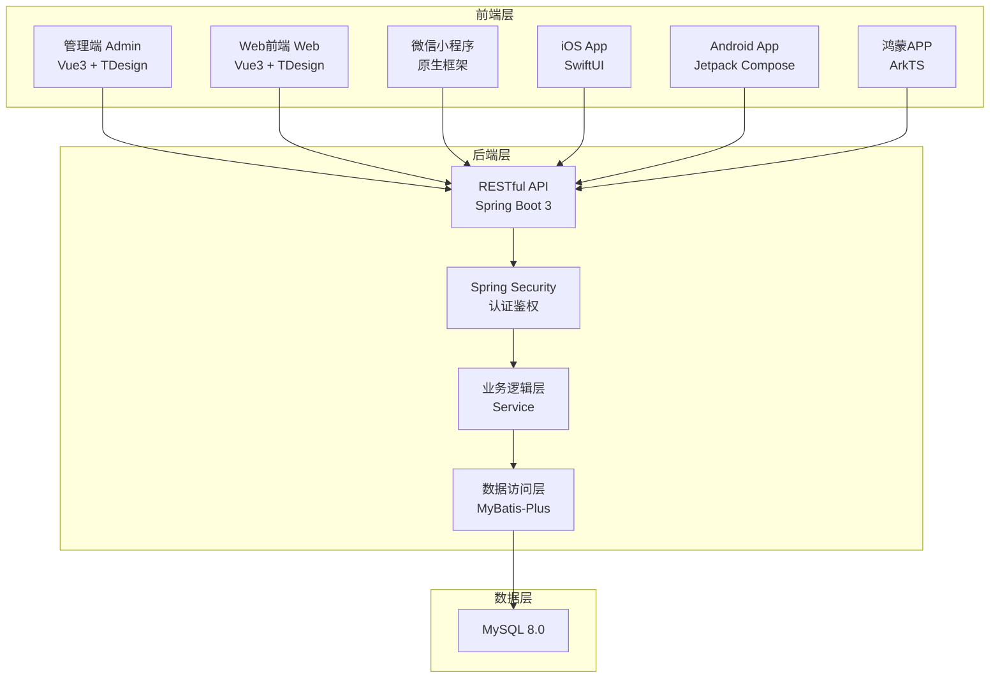

## 项目概述

初始化 neoapp 全栈项目，涵盖后端、管理端、Web前端、微信小程序、iOS、Android、鸿蒙APP七个模块。采用前后端分离架构，后端提供RESTful API，前端采用简约自适应风格，兼容PC、平板和手机。

## 核心功能

- **后端基础架构**：Spring Boot 3 + MyBatis-Plus + Spring Security 完整脚手架，统一响应格式 { code, msg, data }，全局异常处理，CORS跨域配置，MySQL数据源配置
- **管理端 admin**：Vue 3 + Vite + TDesign 管理后台，含登录页、仪表盘、侧边导航的响应式布局，Axios请求封装，Pinia状态管理
- **Web前端 web**：Vue 3 + Vite + TDesign 用户端，含首页和基础布局的响应式设计，与后端API对接
- **微信小程序 wxmini**：原生小程序基础脚手架，含app配置和首页示例
- **iOS app**：SwiftUI 基础工程结构，含主入口和内容视图
- **Android app**：Kotlin + Jetpack Compose 基础工程结构，含MainActivity和基础Gradle配置
- **鸿蒙APP harmony**：ArkTS 基础工程结构，含entry模块和首页示例

## 技术栈选型

### 后端技术栈

- **语言**：Java 21 (LTS)
- **框架**：Spring Boot 3.4.x
- **ORM**：MyBatis-Plus 3.5.x
- **安全**：Spring Security 6.x + JWT
- **数据库**：MySQL 8.0
- **构建工具**：Maven 3.9+
- **连接池**：HikariCP (Spring Boot 默认)
- **接口规范**：RESTful API，统一返回 Result 封装

### 管理端 / Web前端技术栈

- **框架**：Vue 3.5+ (Composition API + `<script setup>`)
- **构建工具**：Vite 6.x
- **UI组件库**：TDesign Vue Next
- **路由**：Vue Router 4.x
- **状态管理**：Pinia 2.x
- **HTTP客户端**：Axios 1.x
- **样式方案**：CSS3 + TDesign 主题变量，媒体查询实现响应式

### 移动端 / 小程序技术栈

- **微信小程序**：原生框架 (WXML + WXSS + JS)
- **iOS**：Swift 6 + SwiftUI (iOS 17+)
- **Android**：Kotlin 2.x + Jetpack Compose (API 26+)
- **鸿蒙**：ArkTS + ArkUI (HarmonyOS NEXT)

## 实现方案

### 后端初始化策略

采用标准 Maven 多模块单层结构，在 `backend/` 下建立完整的 Spring Boot 工程。核心设计决策：

- **统一响应**：定义 `Result<T>` 泛型类，配合 `GlobalExceptionHandler` 全局拦截异常，确保所有接口输出格式一致
- **安全层**：Spring Security 配置允许跨域、放行静态资源，预留JWT认证扩展点，初始阶段配置开发模式宽松策略
- **数据层**：MyBatis-Plus 配置分页插件、逻辑删除、自动填充（create_time/update_time），定义 `BaseEntity` 基类统一实体字段
- **配置分层**：`application.yml` 公共配置 + `application-dev.yml` 开发环境配置分离

### 前端初始化策略

- **admin 与 web** 采用相同技术栈但独立工程，通过不同的路由结构和布局组件区分角色
- **响应式设计**：基于 TDesign 的栅格系统和 CSS 媒体查询，实现 手机 (<768px) / 平板 (768px-1200px) / PC (>1200px) 三档适配
- **请求封装**：Axios 实例统一配置 baseURL、拦截器（请求注入token、响应解包统一错误处理）
- **布局模式**：admin 采用侧边导航+顶栏经典管理后台布局；web 采用顶栏+内容区+底栏的用户端布局

### 移动端初始化策略

各移动端平台生成最小可运行的基础脚手架，包含入口文件、基础页面、平台配置文件，确保开发者可立即进入业务开发。

## 架构设计

### 系统架构图



### 数据流

```
前端请求 → Axios拦截器(注入Token) → CORS过滤器 → Spring Security(鉴权)
→ Controller(参数校验) → Service(业务逻辑) → Mapper(MyBatis-Plus) → MySQL
→ Result封装 → 全局异常拦截 → JSON响应 → Axios响应拦截器(解包) → 前端渲染
```

## 目录结构

```
neoapp/
├── backend/                            # [NEW] Spring Boot 后端工程
│   ├── pom.xml                         # Maven项目配置，父POM管理依赖版本
│   └── src/main/
│       ├── java/com/neoapp/
│       │   ├── NeoAppApplication.java  # Spring Boot启动类
│       │   ├── common/
│       │   │   ├── Result.java         # 统一响应封装 {code, msg, data}
│       │   │   └── GlobalExceptionHandler.java  # 全局异常处理器
│       │   ├── config/
│       │   │   ├── SecurityConfig.java # Spring Security安全配置
│       │   │   ├── MyBatisPlusConfig.java  # MyBatis-Plus分页/填充插件
│       │   │   ├── CorsConfig.java     # CORS跨域配置
│       │   │   └── WebMvcConfig.java   # Web MVC配置
│       │   ├── controller/
│       │   │   └── HealthController.java   # 健康检查接口
│       │   ├── service/                # 业务逻辑层（预留）
│       │   ├── mapper/                 # MyBatis Mapper接口（预留）
│       │   ├── entity/
│       │   │   └── BaseEntity.java     # 实体基类(含通用字段)
│       │   └── dto/                    # 数据传输对象（预留）
│       └── resources/
│           ├── application.yml         # 公共配置
│           ├── application-dev.yml     # 开发环境配置(MySQL等)
│           └── db/
│               └── schema.sql          # 初始建表语句
│
├── admin/                              # [NEW] 管理端前端工程
│   ├── package.json                    # 依赖配置
│   ├── vite.config.js                  # Vite构建配置(代理/别名)
│   ├── index.html                      # HTML入口
│   └── src/
│       ├── main.js                     # Vue应用入口
│       ├── App.vue                     # 根组件
│       ├── router/index.js             # 路由配置(登录/仪表盘/404)
│       ├── utils/request.js            # Axios封装(拦截器/统一错误)
│       ├── stores/user.js              # Pinia用户状态管理
│       ├── layouts/AdminLayout.vue     # 管理后台布局(侧边栏+顶栏)
│       ├── views/
│       │   ├── Login.vue               # 登录页面
│       │   └── Dashboard.vue           # 仪表盘页面
│       └── styles/
│           └── global.css              # 全局样式/响应式断点
│
├── web/                                # [NEW] Web前端工程
│   ├── package.json                    # 依赖配置
│   ├── vite.config.js                  # Vite构建配置
│   ├── index.html                      # HTML入口
│   └── src/
│       ├── main.js                     # Vue应用入口
│       ├── App.vue                     # 根组件
│       ├── router/index.js             # 路由配置(首页/关于)
│       ├── utils/request.js            # Axios封装
│       ├── layouts/WebLayout.vue       # Web用户端布局(顶栏+内容+底栏)
│       ├── views/
│       │   └── Home.vue                # 首页
│       └── styles/
│           └── global.css              # 全局样式/响应式断点
│
├── wxmini/                             # [NEW] 微信小程序
│   ├── app.json                        # 小程序全局配置
│   ├── app.js                          # 小程序入口逻辑
│   ├── app.wxss                        # 全局样式
│   ├── project.config.json             # 项目配置文件
│   └── pages/index/
│       ├── index.js                    # 首页逻辑
│       ├── index.json                  # 首页配置
│       ├── index.wxml                  # 首页模板
│       └── index.wxss                  # 首页样式
│
├── ios/                                # [NEW] iOS工程
│   └── neoapp/
│       ├── neoappApp.swift             # SwiftUI App入口
│       ├── ContentView.swift           # 主内容视图
│       ├── Info.plist                  # 应用配置
│       └── Assets.xcassets/           # 资源目录(基础结构)
│
├── android/                            # [NEW] Android工程
│   ├── settings.gradle.kts             # Gradle设置
│   ├── build.gradle.kts                # 根构建脚本
│   ├── gradle.properties               # Gradle属性
│   └── app/
│       ├── build.gradle.kts            # 应用构建脚本
│       └── src/main/
│           ├── AndroidManifest.xml     # 应用清单
│           └── java/com/neoapp/
│               └── MainActivity.kt     # 主Activity(Compose)
│
├── harmony/                            # [NEW] 鸿蒙APP工程
│   ├── build-profile.json5             # 构建配置
│   ├── hvigorfile.ts                   # Hvigor构建脚本
│   ├── oh-package.json5                # 包管理配置
│   └── entry/src/main/
│       ├── module.json5                # 模块配置
│       └── ets/pages/
│           └── Index.ets               # 首页(ArkTS)
│
└── dev-log/                            # [NEW] 开发日志目录
    └── .gitkeep                        # 保持目录在版本控制中
```

## 关键代码结构

### 统一响应体定义

```java
// Result.java - 统一API响应封装
public class Result<T> {
    private int code;       // 200成功，其他失败
    private String msg;     // 提示信息
    private T data;         // 响应数据

    public static <T> Result<T> success(T data) { ... }
    public static <T> Result<T> success() { ... }
    public static <T> Result<T> error(int code, String msg) { ... }
}
```

### 实体基类

```java
// BaseEntity.java - 所有数据实体的公共字段
public class BaseEntity {
    @TableId(type = IdType.AUTO)
    private Long id;
    @TableField(fill = FieldFill.INSERT)
    private LocalDateTime createTime;
    @TableField(fill = FieldFill.INSERT_UPDATE)
    private LocalDateTime updateTime;
    @TableLogic
    private Integer isDeleted;  // 0未删除 1已删除
}
```

### 前端请求封装

```javascript
// request.js - Axios实例 + 拦截器
const request = axios.create({
  baseURL: '/api',
  timeout: 15000
});
// 请求拦截：注入token
// 响应拦截：统一解包data，处理401跳转登录
```

## 设计风格

采用现代简约风格（Minimalism），以清爽留白和克制配色营造专业、高效的使用体验。通过TDesign组件库的规范设计语言保证视觉一致性，响应式栅格系统实现PC、平板、手机三端自适应。

### 管理端 admin 页面设计

#### 登录页

- **背景区**：左侧或上方展示品牌信息（Logo + 项目名称），右侧或下方为登录表单卡片，背景使用浅灰渐变色
- **表单区**：白色圆角卡片悬浮效果，包含用户名、密码输入框和登录按钮，按钮使用TDesign品牌色，hover时轻微上浮动画
- **响应式**：PC端左右分栏布局（品牌信息左40% + 表单右60%）；移动端上下布局（品牌信息上 + 表单下）

#### 仪表盘页（AdminLayout内）

- **顶栏**：固定顶部，包含汉堡菜单（移动端）、面包屑导航、用户头像下拉菜单（个人信息/退出）
- **侧边栏**：PC端固定左侧240px宽度，可折叠至64px；移动端抽屉式滑出，点击遮罩关闭。菜单项含图标+文字，选中态高亮
- **内容区**：统计数据卡片行（用户数、订单数、收入等），每卡片含图标、数值、环比变化标签；下方为图表预留区域
- **响应式**：<768px 隐藏侧边栏改用抽屉+底部Tab；768px-1200px 侧边栏可折叠；>1200px 完整展开布局

### Web前端 web 页面设计

#### 首页（WebLayout内）

- **顶栏**：Logo居左，导航链接（首页/产品/关于/联系我们）居中或居右，移动端折叠为汉堡菜单
- **Hero区**：大标题 + 副标题 + CTA按钮，背景使用浅色渐变或几何图形装饰，按钮带hover缩放动效
- **特性展示区**：三列卡片网格展示核心功能，每卡片含图标、标题、描述文字，hover时卡片上浮+阴影加深
- **底栏**：版权信息、社交链接、备案号，背景深色文字浅色
- **响应式**：特性区PC端三列、平板两列、手机单列堆叠

### 设计规范

- **圆角**：卡片12px，按钮8px，输入框6px
- **阴影**：卡片使用 0 2px 12px rgba(0,0,0,0.06)，hover时 0 4px 20px rgba(0,0,0,0.1)
- **间距**：模块间距40px，内容区内边距24px，卡片内边距20px
- **过渡**：统一使用 0.3s ease，包括颜色、阴影、位移变化

## Agent Extensions

### Skill

- **writing-plans**
- 用途：在初始化项目前，将需求拆解为结构化、可执行的实施计划
- 预期成果：输出清晰的分步计划，确保每个模块的初始化有序进行，避免遗漏关键配置